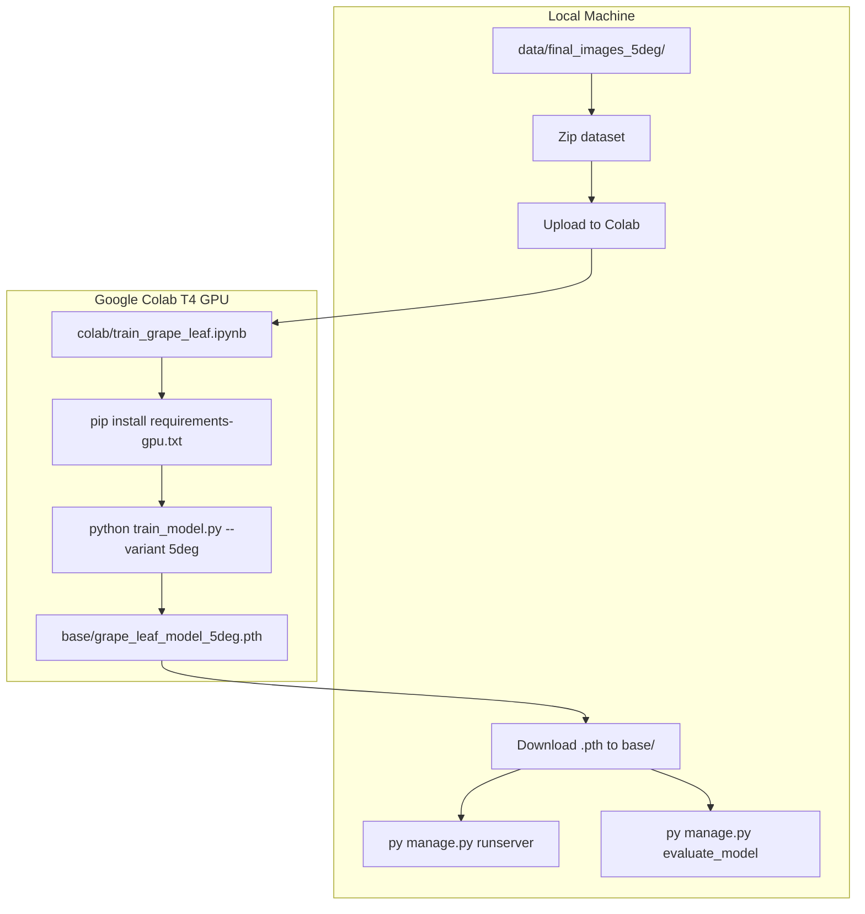

# Google Colab GPU Training — Full Implementation

## Problem

Training currently runs inside Django startup ([`website/base/apps.py`](website/base/apps.py)): when you run `py manage.py runserver` and no `.pth` file exists, it trains on **CPU** (your machine has no CUDA). For the `5deg` variant with 60 epochs, this can take hours.

## Solution

Move all ML training code into a Django-free module, add a standalone CLI, and provide a **Google Colab notebook** that runs training on a **free T4 GPU** (~5–15 minutes). The Django app will only **load** pre-trained weights.



---

## Code Changes

### 1. Extract ML module (Django-free)

Create [`website/ml/`](website/ml/) and move code out of [`website/base/views.py`](website/base/views.py):

| New file | Contents |
|----------|----------|
| [`website/ml/model.py`](website/ml/model.py) | `GrapeLeafRegressor` (lines 29–70 of views.py) |
| [`website/ml/dataset.py`](website/ml/dataset.py) | `GrapeLeafDataset` (lines 73–121) |
| [`website/ml/train.py`](website/ml/train.py) | `train_grape_leaf_model()` (lines 166–291) |

Update imports in:
- [`website/base/views.py`](website/base/views.py) — import from `ml.*`, keep inference/evaluation helpers
- [`website/base/apps.py`](website/base/apps.py) — import `GrapeLeafRegressor` from `ml.model`
- [`website/base/management/commands/evaluate_model.py`](website/base/management/commands/evaluate_model.py) — import `GrapeLeafDataset` from `ml.dataset`

### 2. Standalone training CLI

Create [`website/train_model.py`](website/train_model.py):

```bash
python train_model.py --variant 5deg --device cuda
```

- Reads variant from [`website/model_config.py`](website/model_config.py) (default) or `--variant` flag
- Auto-detects CUDA; prints GPU name to confirm T4 on Colab
- Trains from `{images_folder}/train/` and `validation/` (existing split folders)
- Saves to `website/base/{model_file}` — same path the Django app expects today

### 3. Disable auto-training on Django startup

Change [`website/base/apps.py`](website/base/apps.py):

- **If `.pth` exists** → load it (unchanged)
- **If missing** → log a clear message: *"Run `python train_model.py` locally or in Colab"* — do **not** train on `runserver`

### 4. GPU training optimizations

In [`website/ml/train.py`](website/ml/train.py), when `device.type == "cuda"`:

- `DataLoader(..., num_workers=2, pin_memory=True, batch_size=64)`
- CPU path stays at batch 32, no `pin_memory`

### 5. GPU requirements (Colab-only deps)

Create [`website/requirements-gpu.txt`](website/requirements-gpu.txt) — training deps only, no Django:

```
torch==2.6.0
torchvision==0.21.0
pillow
numpy
matplotlib
tqdm
```

Install on Colab via PyTorch CUDA index:
```bash
pip install torch torchvision --index-url https://download.pytorch.org/whl/cu124
pip install pillow numpy matplotlib tqdm
```

### 6. Google Colab notebook

Create [`website/colab/train_grape_leaf.ipynb`](website/colab/train_grape_leaf.ipynb) with these cells:

1. **Setup runtime** — instructions to select T4 GPU (Runtime → Change runtime type)
2. **Verify GPU** — `!nvidia-smi` and `torch.cuda.is_available()`
3. **Upload dataset** — `files.upload()` for `final_images_5deg.zip`, unzip to `data/final_images_5deg/`
4. **Upload code** — upload `ml/`, `train_model.py`, `model_config.py` (or `git clone` if repo is on GitHub)
5. **Install deps** — CUDA PyTorch + training packages
6. **Train** — `!python train_model.py --variant 5deg --device cuda`
7. **Download weights** — `files.download('base/grape_leaf_model_5deg.pth')`

### 7. Documentation

Create [`website/CLOUD_TRAINING.md`](website/CLOUD_TRAINING.md) — step-by-step Colab guide.

Update [`website/commands.txt`](website/commands.txt) — add Colab training section.

---

## Your Workflow (after implementation)

**One-time local prep:**
1. Set `MODEL_VARIANT = "5deg"` in [`model_config.py`](website/model_config.py)
2. Confirm `data/final_images_5deg/train/` and `validation/` exist (run `split-train-validation.py` if needed)
3. Zip `data/final_images_5deg/` → `final_images_5deg.zip`

**On Google Colab:**
1. Go to [colab.research.google.com](https://colab.research.google.com) → upload `train_grape_leaf.ipynb`
2. Runtime → Change runtime type → **T4 GPU**
3. Run all cells (~5–15 min)

**Back on your machine:**
1. Place downloaded `.pth` in `website/base/`
2. `py manage.py runserver` — loads weights instantly, no training
3. `py manage.py evaluate_model` — generates charts in `eval_images_5deg/`

---

## Files Summary

| File | Action |
|------|--------|
| `website/ml/model.py` | Create |
| `website/ml/dataset.py` | Create |
| `website/ml/train.py` | Create |
| `website/ml/__init__.py` | Create |
| `website/train_model.py` | Create |
| `website/requirements-gpu.txt` | Create |
| `website/colab/train_grape_leaf.ipynb` | Create |
| `website/CLOUD_TRAINING.md` | Create |
| `website/base/views.py` | Refactor imports |
| `website/base/apps.py` | Load-only, no auto-train |
| `website/commands.txt` | Add Colab section |

---

## Expected Result

- Training on a **free Colab T4 GPU** in one notebook session
- Django never trains on startup — only loads `.pth`
- Same `MODEL_VARIANT` config works for training, inference, and evaluation
- Repeat for other variants by changing `--variant` and uploading the matching dataset zip
